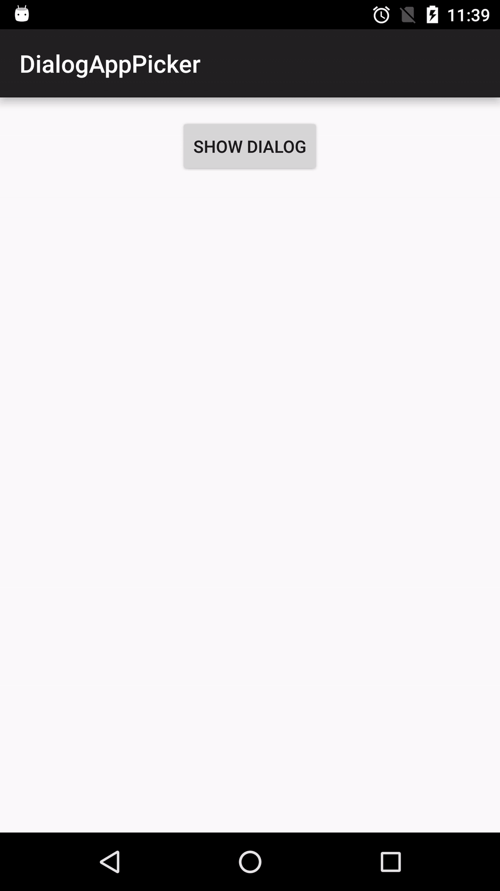

# PBDialogAppPicker

PBDialogAppPicker is a dialog view which enable you to easily pick an app or a shortcut on your device.

   

## Version
1.0.0  
## Installation

With Gradle simply add to your build.gradle
```sh
compile 'com.thefrenchtouch:pbdialogapppicker'
```
or  Copy paste the pbdialogapppicker folder on your project
## How to use
 
```java
 DialogAppPicker mDialog = new DialogAppPicker(this);
        mDialog.setOnItemChooseListener(new DialogAppPicker.OnItemChooseListener() {
            @Override
            public void onAppSelected(AppItem item) {
				// Do something with the app
            }

            @Override
            public void onShortcutSelected(ShortcutItem item) {
				// Do something with the shortcut
            }
        });
        
  // Don't forget this also
  @Override
    public void onActivityResult(int requestCode, int resultCode, Intent data) {
        super.onActivityResult(requestCode, resultCode, data);
        mDialog.onActivityResult(requestCode, resultCode, data);
  }

``` 

## Thanks
Thanks to [GravityBox](https://github.com/GravityBox/GravityBox).

## License

MIT License

Copyright (c) [2016] [Paul Bancarel]

Permission is hereby granted, free of charge, to any person obtaining a copy
of this software and associated documentation files (the "Software"), to deal
in the Software without restriction, including without limitation the rights
to use, copy, modify, merge, publish, distribute, sublicense, and/or sell
copies of the Software, and to permit persons to whom the Software is
furnished to do so, subject to the following conditions:

The above copyright notice and this permission notice shall be included in all
copies or substantial portions of the Software.

THE SOFTWARE IS PROVIDED "AS IS", WITHOUT WARRANTY OF ANY KIND, EXPRESS OR
IMPLIED, INCLUDING BUT NOT LIMITED TO THE WARRANTIES OF MERCHANTABILITY,
FITNESS FOR A PARTICULAR PURPOSE AND NONINFRINGEMENT. IN NO EVENT SHALL THE
AUTHORS OR COPYRIGHT HOLDERS BE LIABLE FOR ANY CLAIM, DAMAGES OR OTHER
LIABILITY, WHETHER IN AN ACTION OF CONTRACT, TORT OR OTHERWISE, ARISING FROM,
OUT OF OR IN CONNECTION WITH THE SOFTWARE OR THE USE OR OTHER DEALINGS IN THE
SOFTWARE.